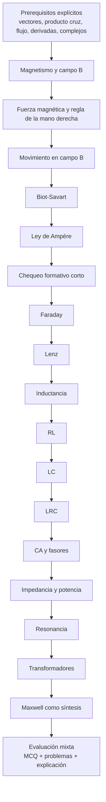

# Auditoría analítica de la guía de estudio de FIS1533 sobre Electricidad y Magnetismo

## Resumen ejecutivo

La guía entregada es un recurso **ambicioso y con valor instructional real**: integra explicación conceptual, fórmulas, diagramas SVG, simulaciones interactivas en *canvas*, un formulario-resumen y un quiz autocorregido. Como objeto de estudio autónomo, su principal fortaleza es que **reduce fricción cognitiva** al reunir en una sola pieza temas de magnetostática, inducción, circuitos transientes, CA, resonancia y transformadores, con una presentación visual consistente y una secuencia global razonable. Sin embargo, el archivo **no declara objetivos de aprendizaje, audiencia objetivo, duración, criterios de evaluación, guía docente ni licencia**, por lo que su alineación curricular debe inferirse y su reutilización institucional queda jurídicamente ambigua. fileciteturn0file0

En lo disciplinar, la guía es **mayoritariamente correcta**, pero contiene errores y ambigüedades que conviene corregir antes de usarla como recurso principal o publicarla en abierto. Los hallazgos más importantes son: un error conceptual en la **pregunta 1 del quiz** sobre la dirección de la fuerza magnética sobre un electrón; una **explicación algebraicamente inconsistente** en la pregunta 5 sobre frecuencia de resonancia; una formulación **confusa de la ley de Curie** en materiales paramagnéticos; el uso **inconsistente** de la reactancia capacitiva con y sin signo; una presentación de la **ley de Ampère** que debería rotularse explícitamente como caso magnetostático; y un **simulador LRC** cuyo trazo “críticamente amortiguado” no coincide con la condición crítica que el mismo texto expone. fileciteturn0file0

En lo pedagógico, el recurso funciona bien como **guía de repaso**, pero no todavía como secuencia instruccional completa. Le faltan: objetivos por módulo, prerrequisitos explícitos, ejemplos resueltos paso a paso en los temas más abstractos, pausas formativas, mayor variedad de evaluación, rúbricas, andamiaje para estudiantes con dificultades y orientaciones docentes para implementación. Desde el lente UDL, el material ofrece múltiples medios de **representación** (texto, fórmulas, diagramas, animaciones), pero es débil en **acción/expresión** y **engagement** porque casi toda la respuesta esperada del estudiante es lectura/observación y solo aparece un breve quiz de selección múltiple. CAST recomienda precisamente ampliar representación, expresión/comunicación y compromiso mediante opciones, apoyos y retroalimentación orientada a la acción. citeturn9view0

En accesibilidad, la base es aceptable —hay estructura semántica con títulos, idioma de página y etiquetas visibles en varios controles—, pero el recurso no alcanza todavía un estándar robusto de accesibilidad web. Los criterios WCAG más tensionados son: **alternativas textuales** para contenido no textual, **uso de color** como señal principal, **contraste mínimo** para microtexto, **contraste no textual** de ciertos objetos gráficos, **operabilidad por teclado** de toda la experiencia, **pausa/detención** de animaciones automáticas y **mensajes de estado programáticamente anunciables** para la retroalimentación del quiz. WCAG 2.2 exige, entre otras cosas, texto normal con contraste mínimo de **4.5:1**, contenidos no textuales con alternativas equivalentes, funcionalidad operable por teclado, y mecanismos para pausar contenido en movimiento que se inicia automáticamente por más de cinco segundos. citeturn10view0turn11view1turn11view0turn12view0turn10view3

Mi conclusión es que la guía tiene **alto valor agregado** y puede transformarse en un excelente recurso de estudio universitario con un conjunto de correcciones relativamente acotado. La prioridad inmediata no es “rediseñar todo”, sino **sanear exactitud**, **hacer explícita la alineación**, **mejorar accesibilidad básica**, y **convertir el quiz final en una estrategia de evaluación distribuida**. Con esas mejoras, el recurso puede pasar de “muy buen apunte interactivo” a “material instruccional reutilizable y defendible académicamente”. fileciteturn0file0turn10view0turn9view0

## Alcance y metodología

El alcance de esta auditoría cubre el **archivo HTML completo** provisto por el usuario, incluyendo estructura, textos, fórmulas, diagramas, simulaciones embebidas, formulario, quiz y código visible de interacción. No se auditaron materiales externos adicionales porque **no se adjuntaron** programa del curso, syllabus, rúbricas institucionales, planificaciones, hojas de trabajo, diapositivas ni videos separados. Tampoco se proporcionaron objetivos de aprendizaje formales, nivel exacto de la cohorte o duración prevista de uso, por lo que la alineación se reconstruyó a partir del contenido del propio recurso. fileciteturn0file0

La metodología siguió cinco lentes complementarios. Primero, un **análisis de contenido** por sección para inferir objetivos, cobertura, profundidad, prerrequisitos, secuencia, redundancias y vacíos. Segundo, una **revisión disciplinar** de exactitud y consistencia interna. Tercero, una **evaluación pedagógica** centrada en alineación entre contenidos, actividades y evaluación. Cuarto, una **revisión de accesibilidad** con criterios WCAG 2.2 básicos: texto alternativo, estructura, uso de color, contraste, teclado, movimiento, etiquetas y mensajes de estado. Quinto, un análisis de **diferenciación y engagement** usando como referencia UDL de CAST, además de una revisión de **licenciamiento y reutilización** con base en Creative Commons. fileciteturn0file0turn3view0turn9view2turn9view0turn13view0

Dado que el usuario pidió asumir ausencia de estándares específicos cuando no se informaran, **no impuse un estándar disciplinar externo obligatorio**. En cambio, evalué la guía contra tres marcos mínimos y ampliamente aceptados para este tipo de material digital: coherencia curricular inferida, accesibilidad web y diseño universal del aprendizaje. Esto permite emitir un juicio útil sin inventar objetivos no declarados. fileciteturn0file0turn9view2turn9view0

## Diagnóstico global

### Mapa de alineación inferida

La guía cubre una progresión clásica de electromagnetismo universitario: campo magnético y fuerza magnética; movimiento de partículas; Biot-Savart y Ampère; inducción de Faraday-Lenz; materiales magnéticos; inductancia y energía; circuitos RL, LC y LRC; corriente alterna, impedancia, resonancia y transformadores; cierre con ecuaciones de Maxwell, formulario y quiz. Esa secuencia es **globalmente coherente** para un curso introductorio-intermedio y favorece la construcción de una narrativa conceptual razonable: de campos y fuerzas a inducción, y de allí a circuitos y aplicaciones. fileciteturn0file0

Sin embargo, la alineación se debilita porque los **objetivos no están escritos**. Eso produce tres efectos: el alumno no sabe con precisión qué debe dominar en cada bloque; el docente no puede verificar cobertura respecto de resultados esperados; y la evaluación final no demuestra exhaustivamente el logro de los contenidos más densos. Por ejemplo, Biot-Savart, Ampère, Lenz, fasores e impedancia aparecen en el cuerpo del texto, pero el quiz final **no los muestrea de forma suficiente**. fileciteturn0file0

### Fortalezas transversales

Las fortalezas más claras son la **integración multimodal**, la **consistencia visual**, el uso de **analogías útiles** y la presencia de **interactividad**. El estudiante encuentra en un mismo recurso explicaciones, ecuaciones, tablas comparativas, gráficas, simuladores y un cierre de autoevaluación. Esta densidad funcional aporta valor añadido frente a un apunte lineal. También destaca positivamente la incorporación de un ejemplo contextual nacional en corriente alterna al mencionar **220 V rms y 50 Hz**; aunque es un gesto pequeño, muestra intención de contextualización. fileciteturn0file0

Otra fortaleza importante es la claridad de varias distinciones conceptuales: fuerza eléctrica vs. magnética, almacenamiento de energía en resistor vs. inductor, y analogía masa-resorte para LC/LRC. Estas comparaciones ayudan a estudiantes que necesitan puentes cognitivos entre modelos. Desde UDL, eso fortalece la representación de “grandes ideas y relaciones” y apoya la conexión entre conocimiento previo y nuevo aprendizaje. fileciteturn0file0turn9view0

### Debilidades críticas

Hay cuatro debilidades críticas que deberían corregirse antes de reutilizar la guía sin supervisión estrecha. La primera es la **exactitud**: el quiz contiene al menos un error conceptual claro y una explicación matemática defectuosa, lo que erosiona credibilidad. La segunda es la **alineación evaluativa**: el único instrumento de cierre es demasiado breve y cubre una muestra estrecha del dominio. La tercera es la **accesibilidad técnica**: simulaciones, animaciones y feedback no están acompañados de alternativas equivalentes ni mecanismos de pausa y anuncio robustos. La cuarta es la **ausencia de metadata educativa**: objetivos, duración, materiales, guía docente y licencia. fileciteturn0file0turn11view1turn12view0turn10view3

### Secuencia recomendada

La secuencia actual del archivo es razonable, pero recomiendo **insertar dos puentes** que hoy faltan: uno entre Ampère y Faraday para explicitar el paso de campo en régimen estacionario a cambios temporales, y otro entre LRC y CA para explicar por qué se cambia de ecuaciones diferenciales en el tiempo a análisis fasorial en frecuencia. Sin esos puentes, algunos estudiantes percibirán la Unidad 4 como un salto de notación, no como continuidad conceptual. fileciteturn0file0

## Auditoría detallada del contenido

### Unidad de magnetostática e inducción

La siguiente matriz reconstruye objetivos, cobertura y mejoras sugeridas para cada sección de la Unidad 3 a partir del archivo entregado. fileciteturn0file0

| Sección | Objetivos de aprendizaje inferidos | Cobertura y profundidad | Prerrequisitos y secuencia | Redundancias/gaps/precisión | Edición precisa recomendada |
|---|---|---|---|---|---|
| Magnetismo y campo magnético | Distinguir campo eléctrico y magnético; reconocer fuentes de **B**; interpretar líneas de campo | Cobertura introductoria clara; profundidad adecuada para repaso | Requiere noción previa de campo y cargas | Falta objetivo y definición operacional de unidades de **B** al inicio; “monopolos magnéticos no existen” conviene suavizarlo | Reescribir: “No se han observado monopolos magnéticos; por ello, en electromagnetismo clásico se usa \(\oint \vec B\cdot d\vec A=0\).” Añadir unidad tesla y ejemplo de brújula |
| Fuerza magnética | Aplicar \(\vec F=q\vec v\times \vec B\); distinguir dirección, magnitud y trabajo nulo | Buena cobertura conceptual; incluye comparación con fuerza eléctrica | Requiere producto cruz y vectores 3D | Falta ejemplo numérico completo con signos; la RMD debería incluir caso con ejes cartesianos | Añadir ejemplo resuelto con \(\vec v=\hat i\), \(\vec B=\hat j\), carga positiva y negativa; cerrar con una miniactividad de “predice la dirección” |
| Movimiento en campo B | Relacionar fuerza magnética con movimiento circular/helicoidal; usar \(R\) y \(\omega_c\) | Correcto y sintético | Requiere fuerza centrípeta y decomposición vectorial | El espectrómetro usa \(B'\) sin suficiente explicación de configuración | Añadir diagrama simple del selector de velocidad y explicitar qué campo corresponde a selector y cuál al analizador |
| Biot-Savart | Calcular **B** de distribuciones simples de corriente | Tabla útil, pero densa | Requiere integral de línea y simetría | Solenoide y toroide aparecen aquí aunque suelen trabajarse mejor con Ampère; puede confundir método vs. resultado | Añadir una nota: “Los valores de solenoide y toroide se obtienen más eficientemente con Ampère.” Incluir un ejemplo trabajado de alambre infinito |
| Ley de Ampère | Aplicar integral de línea a problemas con simetría | Conceptualmente correcta | Requiere simetría y recorrido amperiano | La ecuación mostrada es caso magnetostático, pero el rótulo “4ª ecuación de Maxwell” puede inducir error | Cambiar rótulo a: “Forma magnetostática de Ampère”. Debajo: “Forma completa: Ampère-Maxwell” |
| Ley de Faraday | Relacionar fem inducida con variación de flujo | Muy buena presentación cualitativa | Requiere flujo magnético | Faltan problemas con signo y convención de normal | Añadir ejemplo de cálculo con \(\Phi_B=BA\cos\theta\) y una pregunta de interpretación del signo |
| Ley de Lenz | Determinar sentido de corriente inducida | Cobertura visual fuerte | Requiere Faraday y regla de mano derecha | La analogía de “inercia eléctrica” es útil pero debe marcarse como analogía limitada | Reescribir como “analogía heurística, no equivalencia física” y añadir procedimiento de 3 pasos: cambio de flujo → campo inducido → sentido de corriente |
| Materiales magnéticos | Diferenciar dia-, para- y ferromagnetismo | Cobertura superficial suficiente para repaso | Requiere noción de momento magnético | La ley de Curie está formulada de manera ambigua; la nomenclatura \(K_m\) no se justifica; falta relación entre \(\mu_r\) y \(\chi_m\) | Reescribir con \(\chi_m\) y \(\mu_r=1+\chi_m\) en SI; presentar Curie como relación de susceptibilidad y aclarar régimen de validez |

### Unidad de inductancia, circuitos y CA

La Unidad 4 también presenta una secuencia globalmente sólida, pero necesita más andamiaje matemático explícito para estudiantes que no dominan aún ecuaciones diferenciales y números complejos. fileciteturn0file0

| Sección | Objetivos de aprendizaje inferidos | Cobertura y profundidad | Prerrequisitos y secuencia | Redundancias/gaps/precisión | Edición precisa recomendada |
|---|---|---|---|---|---|
| Inductancia | Distinguir autoinductancia e inductancia mutua; relacionar corriente variable y fem | Buena síntesis | Requiere Faraday-Lenz | Fórmula del solenoide ideal necesita aclarar supuestos; falta convención de polaridad | Añadir: “Para solenoide largo ideal, núcleo homogéneo”. Incorporar dibujo de polaridad y ley de Lenz |
| Circuito RL | Resolver crecimiento/decaimiento exponencial y usar \(\tau=L/R\) | Muy útil para repaso | Requiere ecuación diferencial de primer orden | El simulador aporta valor; pero el rótulo \(U_L\) se usa como energía y puede confundirse con voltaje; falta lectura guiada del gráfico | Renombrar a \(U_{B,\max}\) o \(E_{L,\max}\). Añadir 3 preguntas de lectura del gráfico |
| Circuito LC | Entender oscilación libre y conservación de energía | Buena analogía con masa-resorte | Requiere capacitor, inductor, oscilaciones | Falta ejemplo con condiciones iniciales y desfase físico | Añadir caso: capacitor cargado inicialmente, \(i(0)=0\), y preguntar en qué instante \(U_E=U_B\) |
| Circuito LRC | Identificar regímenes de amortiguamiento | Cobertura conceptual correcta | Requiere LC y amortiguamiento | El simulador rotula curva “crítica”, pero el código no coincide con la condición crítica declarada en el texto | Corregir el simulador o cambiar su leyenda hasta que represente efectivamente el caso crítico |
| Corriente alterna | Interpretar ondas senoidales, RMS y fases | Buena entrada a CA | Requiere trigonometría y funciones sinusoidales | Falta transición explícita desde tiempo a fasores; “ELI/ICE” ayuda, pero conviene formalizar | Añadir una subsección “por qué usar fasores” con un ejemplo simple R–L |
| Impedancia y potencia en CA | Calcular \(|Z|\), \(\phi\) y potencia media | Correcta y compacta | Requiere complejos básicos | La reactancia capacitiva aparece con signo en una tabla y sin signo en el formulario; inconsistencia notacional | Unificar convención: usar \(X_C=1/\omega C\) como magnitud y escribir la parte imaginaria como \(-X_C\) |
| Resonancia | Determinar \(f_0\) y relacionar resonancia con máxima corriente | Fuerte conexión con aplicación | Requiere impedancia y reactancias | Buen simulador, pero falta relación con ancho de banda y selectividad como idea de calidad | Añadir opcionalmente factor Q y una nota separando “resonancia” de “amortiguamiento” |
| Transformadores | Aplicar relaciones de espiras, voltaje y corriente | Adecuado como cierre aplicativo | Requiere inducción mutua y AC | El ejemplo “de 220 V a 5 V para cargar dispositivos” es hoy demasiado simplificado | Reescribir como ejemplo didáctico de principio ideal y aclarar que cargadores modernos son fuentes electrónicas con más etapas |

### Recursos de síntesis, formulario y quiz

El cierre con **ecuaciones de Maxwell**, **formulario** y **quiz** es valioso, pero necesita depuración fina. La tabla de Maxwell cumple bien una función de síntesis. El formulario es útil como hoja de repaso, aunque convendría separar “fórmula”, “significado” y “cuándo usarla” para evitar memorización descontextualizada. El quiz ofrece retroalimentación inmediata, pero cinco ítems son insuficientes para representar toda la amplitud del dominio, y además hay errores concretos. fileciteturn0file0

**Errores prioritarios del quiz**:
- **Ítem 1**: el electrón que se mueve en \(+\hat x\) con \(\vec B\) en \(+\hat y\) debe experimentar fuerza hacia **\(-\hat z\)**, no hacia \(+\hat z\). El ítem marca como correcta la alternativa equivocada y la retroalimentación invierte erróneamente el producto cruzado. fileciteturn0file0
- **Ítem 5**: la opción correcta final es razonable, pero la explicación intermedia presenta pasos algebraicos inconsistentes al manipular \(\sqrt{LC}\), por lo que el feedback debe reescribirse por completo. fileciteturn0file0

## Recursos, accesibilidad y evaluación

### Evaluación de recursos actuales y recursos faltantes

El archivo incluye un **apunte HTML principal**, varios **diagramas SVG**, cuatro **simulaciones en canvas**, un **formulario** y un **quiz**. No se identifican **guías de actividades descargables**, **diapositivas**, **videos**, **rúbricas**, **guía docente** ni recursos para impresión. Por lo tanto, cuando el encargo pide evaluar “worksheets, slides, videos, quizzes”, la conclusión correcta es que **solo el quiz y el material interactivo principal están presentes**; los otros tipos de recurso no figuran en el archivo provisto. fileciteturn0file0

| Recurso actual | Estado | Juicio | Recomendación |
|---|---|---|---|
| HTML interactivo principal | Presente | Alto valor como apunte multimodal | Mantener como recurso central |
| Diagramas SVG | Presentes | Buenos para representación conceptual | Añadir descripciones textuales breves |
| Simulaciones RL, LC, LRC, resonancia | Presentes | Alto valor, pero con brechas de accesibilidad y una inconsistencia en LRC | Agregar alternativa textual, pausa y revisión de exactitud |
| Formulario-resumen | Presente | Útil para repaso; débil para comprensión profunda | Convertirlo en “fórmula + interpretación + error común” |
| Quiz autocorregido | Presente | Buena idea, baja cobertura y dos problemas de exactitud | Corregir ítems y ampliar banco de preguntas |
| Worksheets | Ausentes | Gap relevante | Crear una guía de problemas descargable |
| Slides | Ausentes | No crítico, pero útil para docencia | Preparar versión docente resumida |
| Videos/transcripciones | Ausentes | Gap para diferenciación | Crear microvideos o al menos narraciones/transcript |

### Accesibilidad y WCAG básicos

La guía sí cumple algunos elementos base: declara idioma de página, usa títulos jerárquicos, presenta etiquetas visibles en varios controles y evita, en general, imágenes de texto para comunicar contenido principal. Sin embargo, hay brechas claras respecto de WCAG 2.2. Las más importantes son: ausencia de alternativas equivalentes para elementos gráficos complejos y simulaciones; uso relevante del color para distinguir series, estados y categorías; falta de mecanismos para pausar animaciones automáticas; y feedback del quiz no anunciado programáticamente como mensaje de estado. WCAG exige alternativas textuales para contenido no textual, prohíbe usar solo color como medio de información, exige operación por teclado, define criterios para contenido en movimiento y establece que los mensajes de estado deben ser programáticamente determinables. fileciteturn0file0turn11view1turn10view2turn11view0turn12view0turn10view3

En la revisión técnica del CSS del archivo, los colores “muted” declarados para microtexto y navegación secundaria (\#64748b sobre \#0d0f14 y \#13161e) arrojan una relación de contraste aproximada de **4.03:1** y **3.80:1**, respectivamente. Para texto normal, WCAG AA exige **al menos 4.5:1**, por lo que ese microcopy no es suficientemente seguro para cuerpos pequeños de 10–14 px, exactamente el rango que la guía usa con frecuencia en etiquetas, pies y notas. fileciteturn0file0turn10view0

Las simulaciones en *canvas* merecen observación aparte. Aunque aportan mucho a la comprensión, un canvas sin alternativa textual equivalente deja fuera a usuarios con lector de pantalla o con limitaciones visuales severas; además, la animación LC se inicia automáticamente y no ofrece control visible de pausa/stop. WCAG pide alternativas textuales para contenido no textual y mecanismos para pausar o detener información en movimiento que inicia automáticamente y se presenta en paralelo con otros contenidos. fileciteturn0file0turn11view1turn12view0

La retroalimentación del quiz también debe mejorarse. Hoy el feedback aparece visualmente al responder, pero no hay evidencia de `role="status"`, `aria-live` u otra estrategia que permita a tecnologías asistivas anunciar el cambio sin mover el foco. WCAG 4.1.3 aborda precisamente este tipo de mensajes de estado. fileciteturn0file0turn10view3

Desde UDL, la guía ya ofrece **múltiples formas de representación**, pero casi no ofrece alternativas de **expresión** ni de **participación**. Falta elegir rutas, registrar predicciones, explicar razonamientos, colaborar, comparar soluciones o demostrar comprensión en otros formatos. CAST recomienda, entre otras cosas, clarificar vocabulario y símbolos, ilustrar con múltiples medios, conectar conocimiento previo, usar múltiples medios de comunicación y ofrecer retroalimentación orientada a la acción. citeturn9view0

### Estrategia de evaluación y revisión de ítems

La estrategia de evaluación actual está **subdimensionada**: existe una sola instancia explícita de evaluación sumativa-liviana al final, de cinco ítems de alternativa, para un conjunto de contenidos que cubre al menos dos unidades amplias del curso. Eso implica una desalineación entre **amplitud del contenido** y **evidencia de aprendizaje**. Además, temas de alta carga procedimental como Biot-Savart, Ampère, Faraday con signo, impedancia compleja y lectura de transientes no tienen evaluación visible equivalente. fileciteturn0file0

En calidad de ítems, el panorama es mixto. Hay preguntas conceptuales legítimas, como la del comportamiento de inductores en CA o la conservación de energía en LC. Pero el ítem 1 falla por exactitud disciplinar y el ítem 5 por feedback matemático defectuoso. Eso no es un detalle menor: cuando la retroalimentación automática enseña algo incorrecto, el recurso pierde confiabilidad como estudio autónomo. fileciteturn0file0

Recomiendo reemplazar el cierre actual por una estrategia **mixta**: microchecks incrustados por sección, un set de problemas cortos con respuesta abierta y una prueba final con tres formatos: selección múltiple de diagnóstico, problemas de aplicación y una explicación breve de razonamiento. Además, sugiero una rúbrica analítica corta para problemas de electromagnetismo. fileciteturn0file0

#### Muestra de ítems de evaluación recomendados

**Ítem conceptual corregido**  
Una partícula con carga negativa entra con velocidad \(\vec v=+v\hat i\) en una región con \(\vec B=+B\hat j\). La fuerza magnética apunta:  
A) \(+\hat k\)  
B) \(-\hat k\)  
C) \(+\hat i\)  
D) \(-\hat j\)  
**Clave:** B.  
**Retroalimentación:** para carga positiva, \(\hat i\times\hat j=\hat k\); como la carga es negativa, la dirección se invierte a \(-\hat k\). fileciteturn0file0

**Ítem de aplicación**  
Una espira circular de radio \(r\) está en un campo uniforme perpendicular al plano. Si el campo aumenta linealmente con el tiempo, explica en tres pasos cómo determinar el sentido de la corriente inducida usando la ley de Lenz.  
**Criterio esperado:** identificar el cambio de flujo, inferir el campo inducido opuesto al cambio, aplicar regla de mano derecha para el sentido de corriente. fileciteturn0file0

**Ítem procedimental**  
En un circuito RLC serie con \(R=10\ \Omega\), \(L=50\ \text{mH}\), \(C=20\ \mu\text{F}\), calcula \(f_0\), indica si a 1 kHz el circuito es más inductivo o capacitivo, y justifica a partir de \(X_L\) y \(X_C\). fileciteturn0file0

#### Rúbrica breve sugerida para problemas de Faraday-Lenz

| Criterio | Logro alto | Logro medio | Logro inicial |
|---|---|---|---|
| Modelo físico | Identifica correctamente qué magnitud cambia y por qué cambia el flujo | Identifica la variación, pero con justificación parcial | Confunde flujo con campo o área sin relación clara |
| Formalización | Escribe \(\Phi_B\) y \(\mathcal E=-N\,d\Phi_B/dt\) con variables correctas | Usa la ley correcta con notación incompleta | Usa fórmula incorrecta o mezcla leyes |
| Sentido de la corriente | Determina sentido con Lenz y mano derecha sin contradicción | Intuye el sentido, pero la explicación es incompleta | Sentido incorrecto o sin justificación |
| Comunicación | Presenta unidades, signo y conclusión física | Le faltan una o dos piezas de cierre | Resultado poco interpretable |

### Muestras de reescritura precisa

#### Pasaje reescrito sobre ley de Curie

**Versión recomendada**  
“En materiales paramagnéticos, la magnetización inducida aumenta cuando crece el campo aplicado y disminuye cuando aumenta la temperatura. En el régimen lineal, se puede escribir \(M=\chi_m H\), con \(\chi_m>0\). Para muchos paramagnetos ideales, la susceptibilidad sigue aproximadamente la ley de Curie: \(\chi_m=C/T\). Conviene distinguir esta relación de casos ferromagnéticos, donde aparecen dominios, histéresis y una respuesta no lineal.” fileciteturn0file0

#### Pasaje reescrito sobre ley de Ampère

**Versión recomendada**  
“En magnetostática, la ley de Ampère se escribe \(\oint \vec B\cdot d\vec l=\mu_0 I_{\text{enc}}\). Esta forma es especialmente útil cuando hay alta simetría, como en alambres largos, solenoides ideales o toroides. En situaciones variables en el tiempo, la forma completa es la ley de Ampère-Maxwell, que añade la contribución del flujo eléctrico cambiante.” fileciteturn0file0

#### Pasaje reescrito sobre cargadores y transformadores

**Versión recomendada**  
“Como modelo ideal, un transformador puede elevar o reducir el voltaje AC según la razón de espiras. En la práctica, muchos cargadores modernos no son ‘solo un transformador’: incorporan rectificación, conmutación y regulación electrónica. Para fines introductorios, el transformador ideal sigue siendo una excelente aproximación para entender cómo cambia el voltaje y cómo se conserva la potencia en primera aproximación.” fileciteturn0file0

## Implementación y plan de acción

### Notas de implementación

Si esta guía se usa como apoyo de curso, mi estimación razonable es una implementación de **10 a 12 horas** de trabajo estudiantil total, distribuida entre lectura, manipulación de simulaciones, resolución de problemas y evaluación. La versión actual, sin hojas de trabajo adicionales, se presta mejor a un uso de **repaso intensivo** que a una enseñanza completa desde cero. fileciteturn0file0

| Bloque | Tiempo estimado | Materiales sugeridos | Guía docente recomendada |
|---|---:|---|---|
| Magnetismo, fuerza y movimiento | 90 min | pizarra, hojas de vectores, miniquiz | enfatizar producto cruz y signos |
| Biot-Savart y Ampère | 120 min | ejercicios guiados | usar 2 casos resueltos completos |
| Faraday, Lenz y materiales | 120 min | espira/imán o simulador alternativo | trabajar predicción antes de fórmula |
| Inductancia y RL | 90 min | simulador + hoja de lectura de gráficos | ligar \(\tau\) con interpretación física |
| LC y LRC | 120 min | tabla de analogías + problemas | separar bien energía, frecuencia y amortiguamiento |
| CA, impedancia, resonancia y transformadores | 180 min | calculadora, problemas, diagrama fasorial | introducir fasores con ejemplo mínimo |
| Síntesis y evaluación | 60 min | formulario y prueba mixta | cerrar con errores típicos y metacognición |

La guía docente mínima debería incluir: propósito de cada bloque, errores frecuentes, respuestas esperadas, uso sugerido de los simuladores, tiempo recomendado por actividad, y una nota explícita sobre qué partes son **repaso** y cuáles requieren enseñanza previa. Hoy nada de eso aparece en el archivo. fileciteturn0file0

### Plan de acción priorizado

| Horizonte | Acción prioritaria | Impacto | Esfuerzo estimado |
|---|---|---|---|
| Corto plazo | Corregir quiz 1 y feedback de quiz 5 | Muy alto | Bajo |
| Corto plazo | Rotular Ampère como caso magnetostático y unificar notación de \(X_C\) | Alto | Bajo |
| Corto plazo | Reescribir sección de materiales magnéticos y aclarar nomenclatura \(\chi_m\), \(\mu_r\) | Alto | Bajo-medio |
| Corto plazo | Añadir objetivos, prerrequisitos y tiempo estimado por sección | Muy alto | Medio |
| Corto plazo | Añadir licencia explícita y nota de reutilización del recurso | Alto | Bajo |
| Corto plazo | Mejorar accesibilidad base: alt/descripcion, aria-live, pausa de animaciones, contraste de microtexto | Muy alto | Medio |
| Mediano plazo | Incorporar ejemplos resueltos paso a paso en Biot-Savart, Ampère, Faraday e impedancia | Muy alto | Medio |
| Mediano plazo | Crear hoja de ejercicios descargable y guía docente breve | Alto | Medio |
| Mediano plazo | Ampliar evaluación con microchecks y problemas abiertos con rúbrica | Muy alto | Medio |
| Mediano plazo | Agregar contextualización cultural/local adicional | Medio | Bajo-medio |
| Largo plazo | Reemplazar o complementar canvas con visualizaciones accesibles equivalentes | Alto | Alto |
| Largo plazo | Convertir el recurso en paquete OER completo con metadata, licencia, versión PDF accesible y analíticas | Alto | Alto |

### Tabla comparativa final entre estado actual y estado recomendado

| Dimensión | Estado actual | Estado recomendado |
|---|---|---|
| Objetivos de aprendizaje | Implícitos | Explícitos por sección |
| Cobertura disciplinar | Amplia y útil | Amplia, corregida y mejor andamiada |
| Exactitud | Mayormente buena, con errores puntuales | Fiable y consistente |
| Secuenciación | Razonable | Con puentes entre magnetostática–inducción y tiempo–fasores |
| Evaluación | Quiz corto de 5 MCQ | Evaluación distribuida y mixta |
| Accesibilidad | Parcial | WCAG básico cubierto |
| Diferenciación | Baja-media | UDL más robusto |
| Recursos docentes | Ausentes | Guía docente + worksheet + rúbricas |
| Licencia | No declarada | CC explícita y marcado del recurso |
| Valor agregado | Alto como apunte | Muy alto como recurso instruccional reutilizable |

En licenciamiento, la mejora es simple y de alto impacto. Creative Commons ofrece un **selector de licencia**, recomienda marcar explícitamente la obra con la licencia elegida y permite incluir texto plano o HTML con metadata de atribución. El propio sitio recuerda que la licencia CC elegida debe especificarse claramente y que su aplicación es **no revocable**. Hoy el recurso no contiene ese marcado. fileciteturn0file0turn13view0turn9view1

En síntesis: **no recomendaría publicar la guía “tal cual” como material final**, pero sí la recomendaría como base excelente para una versión 1.1. La corrección inmediata de exactitud, alineación y accesibilidad básica tiene una relación impacto/esfuerzo muy favorable. Una vez hechos esos ajustes, el recurso quedaría en una posición fuerte para usarse tanto en repaso autónomo como en docencia apoyada por el profesor. fileciteturn0file0turn10view0turn9view0turn13view0